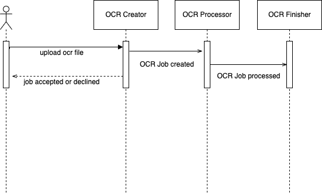
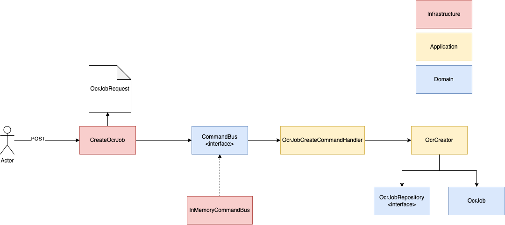

# Bunsan-OCR

This project is an api rest to transform ocr codes to real numbers. The input data is a text file, it produces a file with a number of entries that look like this with a number of entries that look like this:

```
    _  _     _  _  _  _  _ 
  | _| _||_||_ |_   ||_||_|
  ||_  _|  | _||_|  ||_| _|
```

Each entry consists of 4 lines and each line is 27 characters long. The first 3 lines of each entry contain an account number written using pipes and underscores, and the fourth line is blank.
Each account number must have 9 digits, all of which must be in the range 0-9.

To realize the requirements, an asynchronous processing solution is proposed. 

## Sequence diagram



## Creating ocr job flow petition.

